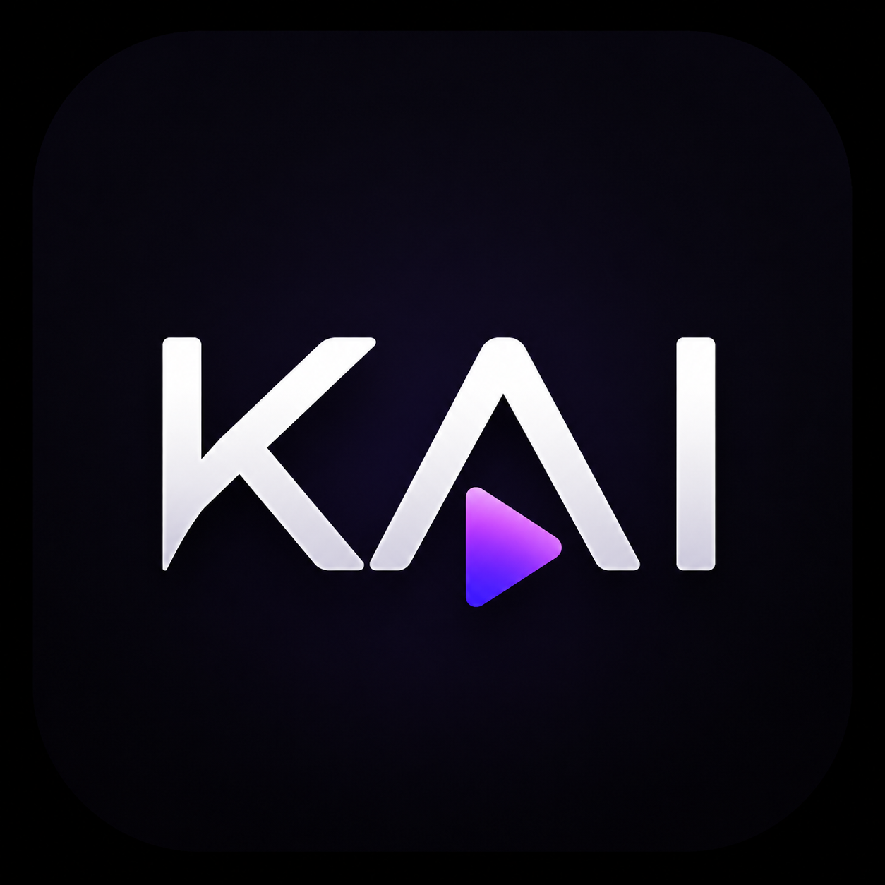

# Kai - Official Releases

Welcome to the official distribution repository for **Kai**, a premium, ad-free streaming client for anime and cinema. 

This repository serves as the public storefront and the Over-The-Air (OTA) update hub for the application.

## 📥 How to Download & Install
1. Navigate to the **Releases** section on the right sidebar of this page (or look for the green "Latest" badge).
2. Download the `Kai-vX.X.apk` file under the **Assets** dropdown directly to your Android device.
3. Open the downloaded file and click **Install**. *(Note: You may need to grant your browser or file manager permission to "Install from Unknown Sources" in your Android settings).*

## 🔄 Automatic In-App Updates
You only need to manually download the app from this page once! 

Kai features a custom-built, native background update engine. The application securely pings this repository to check for new releases. When a new version is available, Kai will seamlessly download the update in the background and natively prompt you to install it without ever making you open a web browser again.

## 🔒 Where is the source code?
To protect the integrity of our custom ad-blocking interceptors and premium streaming architecture, the core Kotlin source code for Kai is maintained in a separate, secure private repository. This public repository is strictly dedicated to hosting the compiled `.apk` files and the master versioning triggers for our users.

---
*Crafted with precision by Alok*
